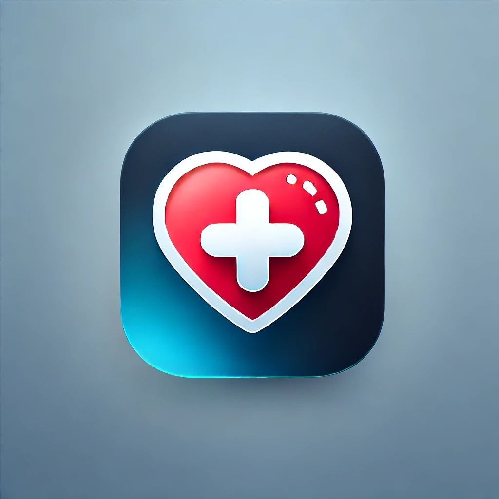

# HealthCheck App

 <!-- Add a logo if you have one -->

HealthCheck is a **health monitoring web application** designed to help users track their health metrics, manage their medical history, and gain insights into their health data. The app features **user authentication**, a **powerful dashboard**, and an **intuitive UI/UX**.

---

## Table of Contents
1. [Features](#features)
2. [Technologies Used](#technologies-used)
3. [Installation](#installation)
4. [Usage](#usage)
5. [Project Structure](#project-structure)
6. [Contributing](#contributing)
7. [License](#license)
8. [Contact](#contact)

---

## Features

### 1. **User Authentication**
   - Secure user registration and login.
   - Password hashing for enhanced security.
   - User profile management.

### 2. **Dashboard**
   - **Edit Personal Info**: Update username, email, and profile picture.
   - **Medical History**: Add, view, and remove diseases from your medical history.
   - **Log Metrics**: Track health metrics such as steps, water intake, sleep, calories, heart rate, blood pressure, and blood sugar.
   - **Metrics Insights**: View a detailed table of all logged metrics with timestamps.

### 3. **UI/UX**
   - Clean and modern design.
   - Responsive layout for seamless use on all devices.
   - Interactive buttons and animations for better user engagement.

---

## Technologies Used

### Backend
- **Flask**: A lightweight Python web framework.
- **SQLAlchemy**: ORM for database management.
- **Flask-Login**: User session management.
- **Flask-Bcrypt**: Password hashing.
- **SQLite**: Database for development.

### Frontend
- **HTML5**: Structure of the web pages.
- **CSS3**: Styling and animations.
- **JavaScript**: Dynamic interactions and form handling.
- **Bootstrap**: Responsive design and pre-built components.
- **Chart.js**: For visualizing health metrics (if applicable).

### Tools
- **Git**: Version control.
- **VS Code**: Code editor.
- **Postman**: API testing.

---

## Installation

### Prerequisites
- Python 3.8 or higher
- pip (Python package manager)

### Steps
1. **Clone the Repository**:
   ```bash
   git clone https://github.com/Mohamedalaagh/HealthCheck
   cd HealthCheck
